#  APNS Sample

This sample shows how to use the Apple Push Notification service **(APNs)** in your iOS 12 application. To receive notifications, the application must run on an actual iPhone device. You cannot receive notifications on the iOS Simulator.

While the prevelant language standard for iOS development at the time of writing *(April 2019)* is Swift, all code for this tutorial is written in Objective-C.  There are many excellent push notification articles on the web for [Swift](https://www.raywenderlich.com/8164-push-notifications-tutorial-getting-started "Push Notifications Tutorial: Getting Started"), but few comprehensive tutorials written for iOS 12 in Objective-C.

## Prerequistes

This tutorial assumes you have signed up for an Apple Developer account and have configured an **iOS Development Certificate** for your app.  You may refer to the Xcode [signing workflow](https://help.apple.com/xcode/mac/current/#/dev60b6fbbc7) for more information.

## Configue your application for Apple Push Notification

To send Push Notifications through the Apple Push Notification Service, you need an SSL certificate associated with an AppID provisioned for push notifications, and a provisioning profile for that AppID.

First, we'll create the SSL Certificate, for which we'll need a certificate signing request file.  This is easy to generate.

* Open the Keychain Access application on your Mac, from the Go menu in the Finder, or by searchinng for 'Keychain Access' with Spotlight.
* On the Keychain Access app menu, navigate to **Keychain Access -> Certificate Assistant -> Request a Certificate from a Certificate Authority, like this:

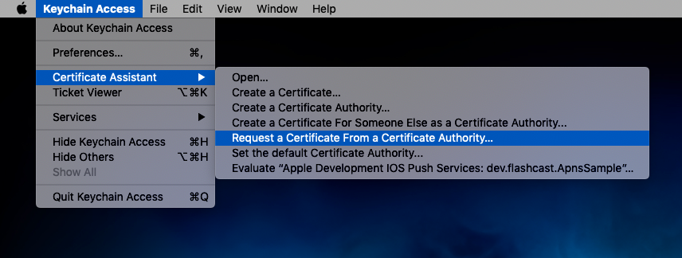

Input your email address and name, and select the **Request is: Saved to disk** radio button.  Click **Continue** to save the `.certSigningRequest` to your Mac.

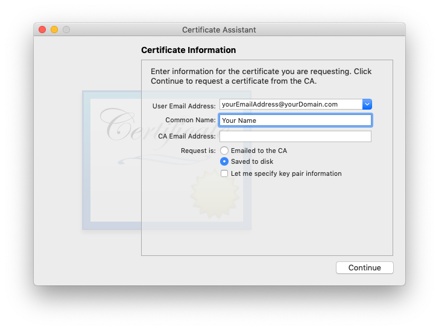

You will need this certificate request later in the provisioning process.

To register your application with the Apple Push Notification service, start Safari and go to the [Apple Developer Program site](https://developer.apple.com "Apple Developer Program website").  Sign in with your Apple Developer ID and then click **Account**. You will see a screen like this, hopefullty with your own name and not mine:


Click on the section that says *Certificates, Identifiers & Profiles*.  You will be taken to a screen that looks like this:

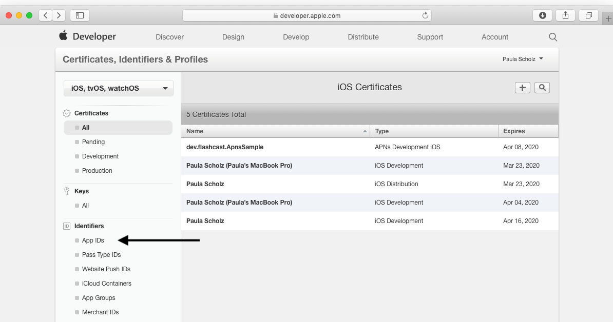

Press the **App IDs** menu choice, and the list will change to **App IDs**.  Click the **+** button to add a new **AppID** like this:

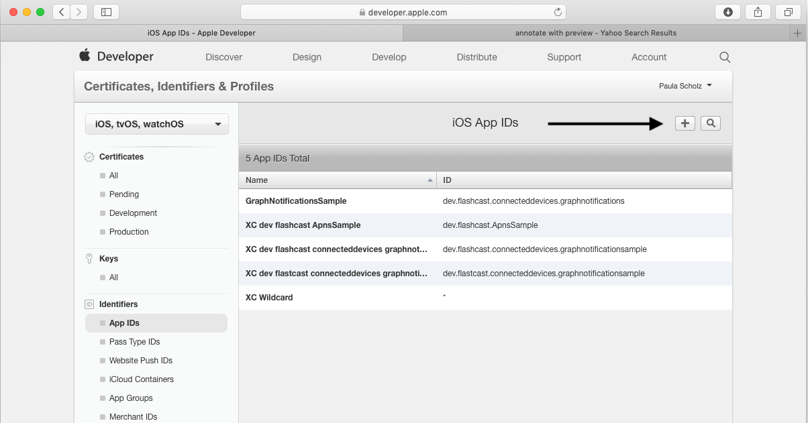

You will be taken to a screen that looks like this:

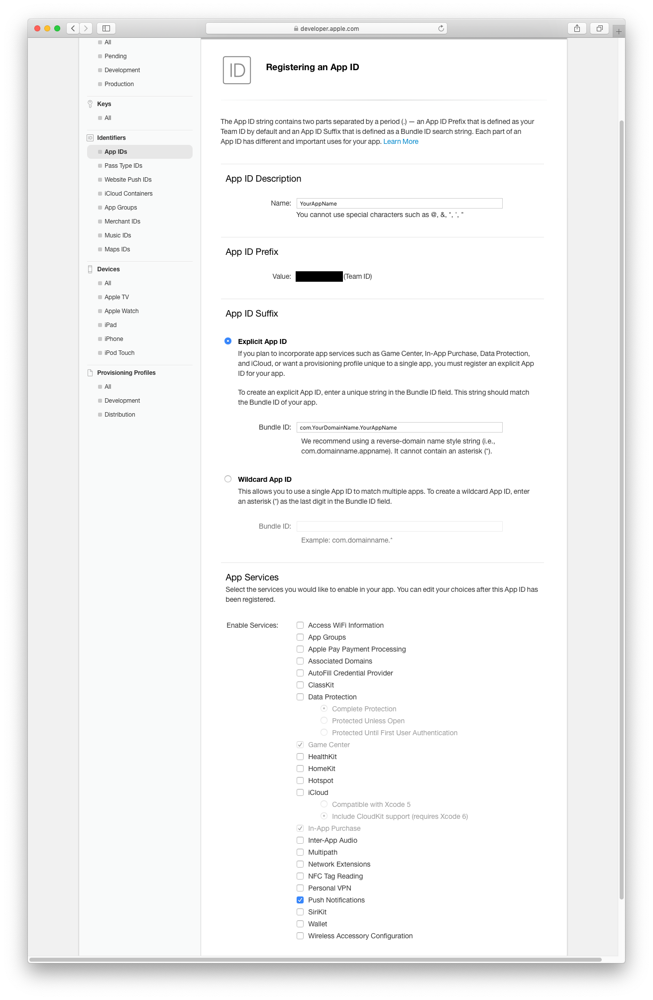

Now, fill in the choice for your application name, and then select the **Explicit App ID** choice and fill in the choice using the convention of *domainSuffix.domainName.yourAppNamne*.  Then, in the **App Services** section below, make sure you select the choice that says **Push Notifications**. Scroll to the bottom of the page and press the **Continue** button.  You will see a screen that looks like this:


If everything looks fine, press the **Register** button to move to the next step.  You will be taken back to the list of **AppIDs**.  Click on the one you just created.


Your selection will expand to show you the details of that **AppID**.  Scroll to the bottom and press the **Edit** button.

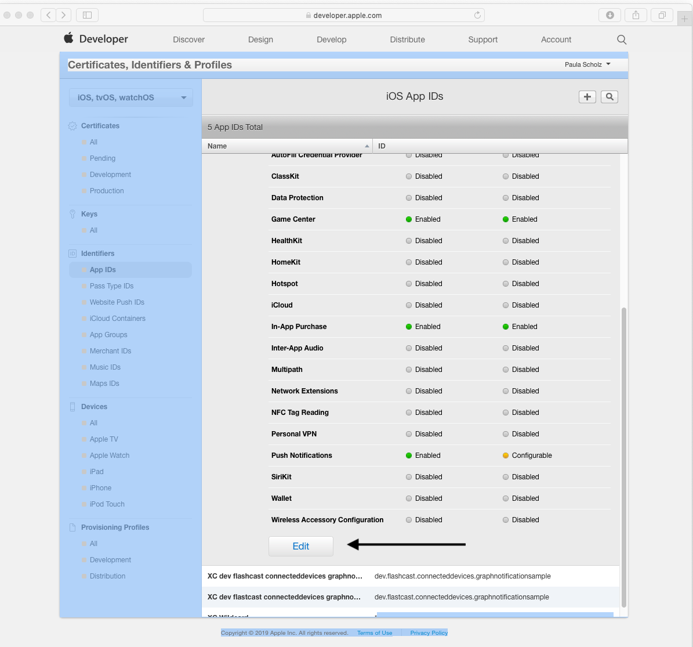

You will see the **iOS App ID Settings** screen.  Scroll down to the Push Notifications section to create your **Apple Push notification service SSL Certificate**, using the `.certSigningRequest` we created in the very first step.  

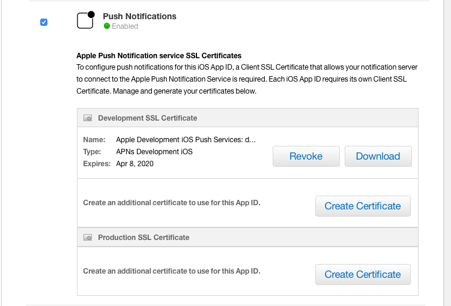

Note that in this screenshot, we have already created our SSL certificate, but we will use the **Create an additional certificate** option to illustrate what to do.  Press the **Create Certificate** button.  You will see a page of instructions that looks like this:

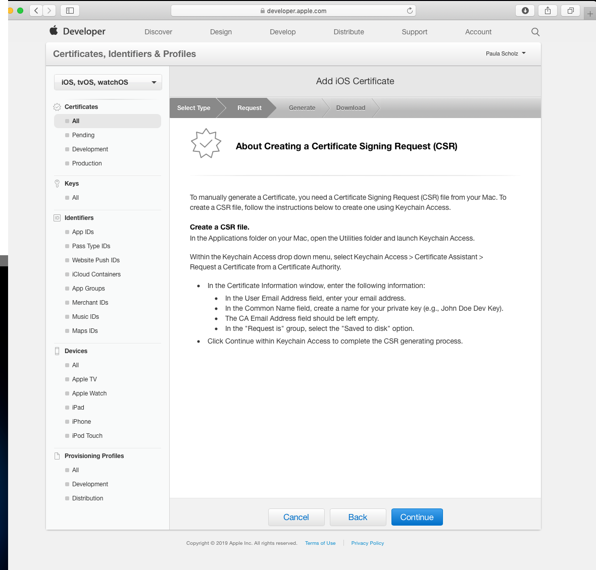

We have already created our certificate request in the first step, so just press the **Continue** button.

Press the **Choose File...** button and upload the `.certSigningRequest` file we created in the very first step, then press the **Continue** button.  When the SSL certificate is ready, click **Download** to save it to your Mac, and click **Done** to close the certificate creation flow.

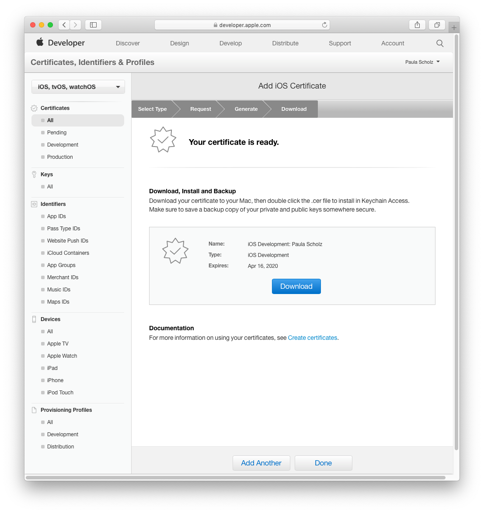

On the Mac, locate the downloaded SSL certificate and double-click it to install it into your keychain.

Now, open **Keychain Access**.  Under **My Certificates**, locate the certificate you just added. It should be called *Apple Development IOS Push Service: your.bundle.id*.

Right-click on the certificate, select **Export Apple Developmennt IOS Push Services: your.bundle.id** and save it as a .p12 file.  Don't enter a password.

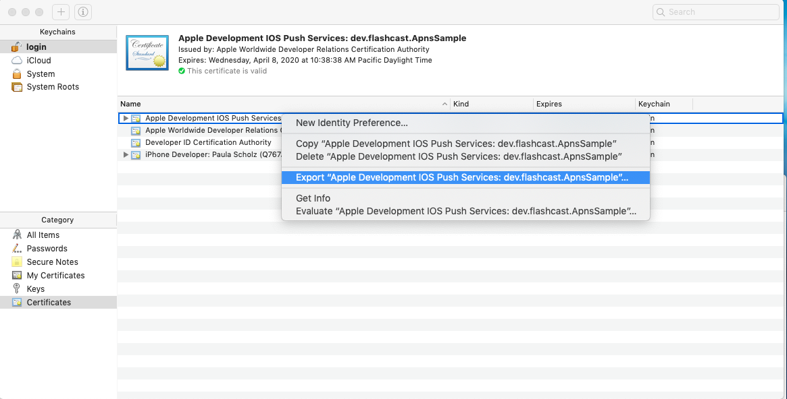

Your app is now enabled to use the Push Notification development certificate.  When you are ready to release, you'll need to repeat this for the Push Notification production environment by clicking **Create Certificate** under the **Production SSL Certificate** section instead of the **Development SSL Certificate.**

You will need this **.p12** certificate to send notifications with your server.  Later in this tutorial, we will use the **pushtry.com** test server to send **Apple Push Notifications** to the app.

## Provisioning Profile

To test your app under development, you need a **Provisioning Profile** for development to authorize test devices to run an app that is not yet published on the **Apple App Store**.

Navigate to the [Apple Developer Member](https://developer.apple.com/account) site and sign in.  Naviate to **Certificates, Identifiers and Profiles**.  In the drop down menu, choose **iOS, tvOS, watchOS** and at the bottom of the left-hand side menu, you will see **Provisioning Profiles** Click **Development** and you will see a screen that looks like this:

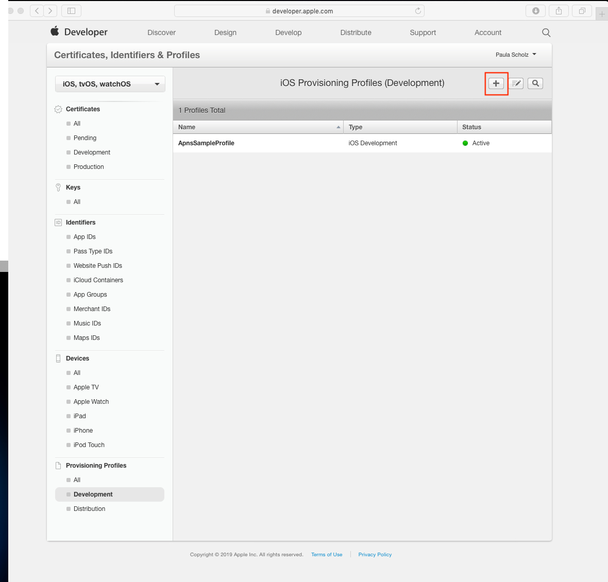

Note that in this screenshot, we have already created our provisioning profile, but we will create another to illustrate the procedure.  Click the **+** button at the top-right to create a new profile.  You will see a screen that looks like this:

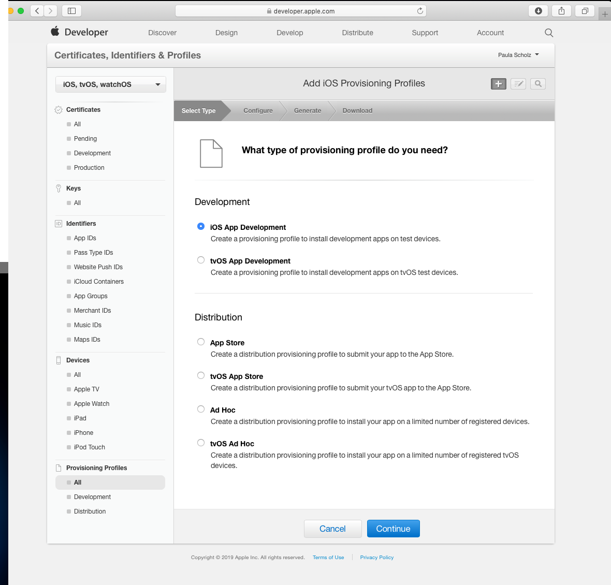

Select the **iOS App Development** choice and press the **Continue** button.  Then, select an AppID in the drop-down menu and press **Continue** again.

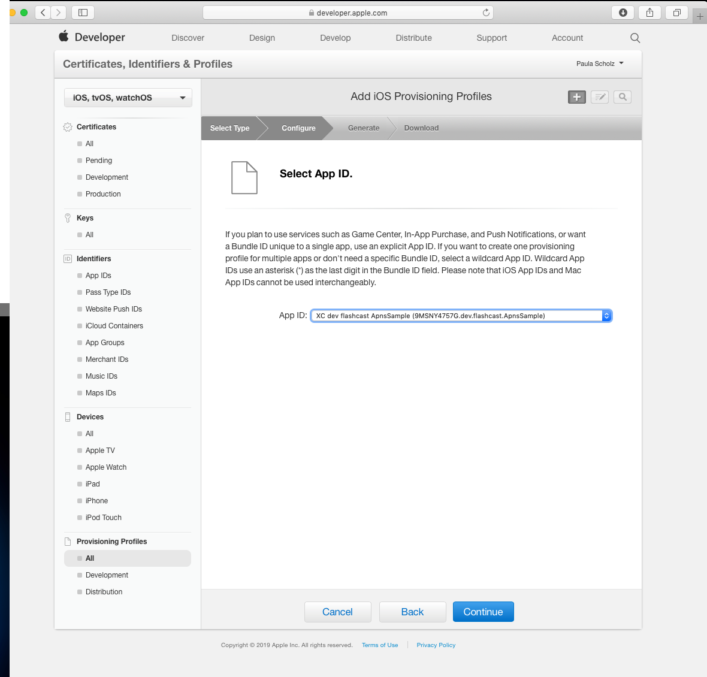

Select the certificates to include in the provisioning profile.  To use this profile to install an app, the certificate the **iOS Development Certificate** the app was signed with must be included.  If you can't remember which one you used, just select them all, and press **Continue**.

Select the test devices you wish to include in this **Provisioning Profile**. To install an app signed with this profile on a device, the device must be included.  Select your devices and press **Continue**.

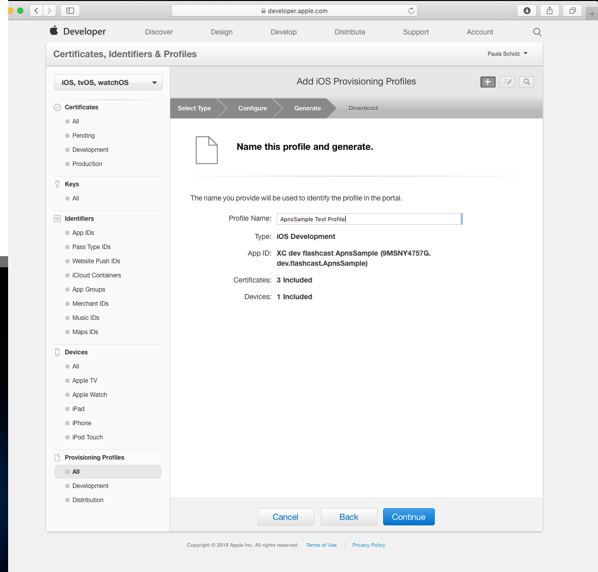

Give your **Provisioning Profile** a name and press **Continue**.  Your profile will be generated and you can download it to your Mac.  

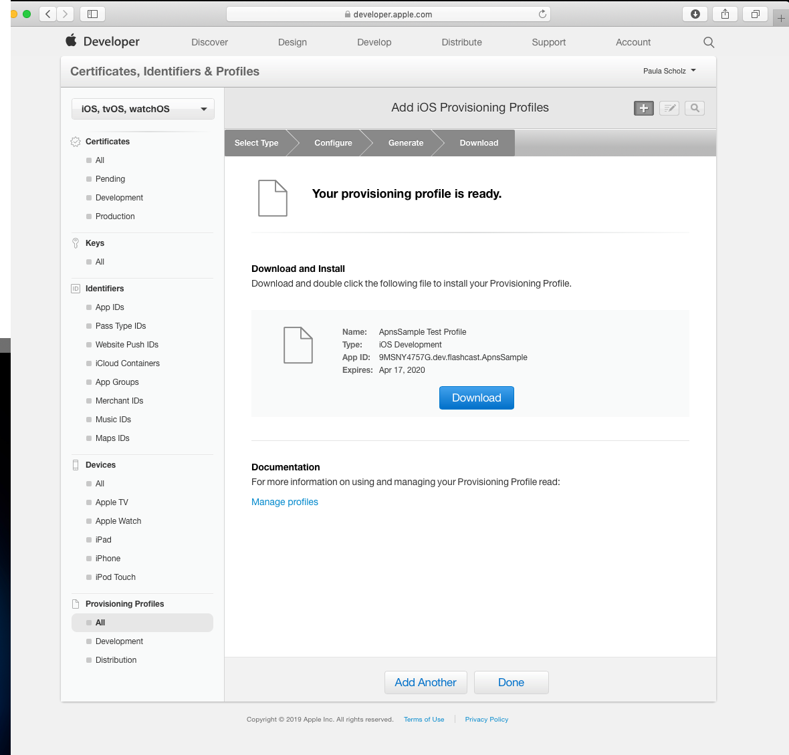

Press the **Done** button. To install the newly-generated **Provisioning Profile**, simply double-click it.

## The Code


```objc
#import <UIKit/UIKit.h>
#import <UserNotifications/UserNotifications.h>

@interface AppDelegate : UIResponder <UIApplicationDelegate, UNUserNotificationCenterDelegate>

@property (strong, nonatomic) UIWindow *window;

@property (strong, nonatomic) NSString *strDeviceToken;

@end
```
