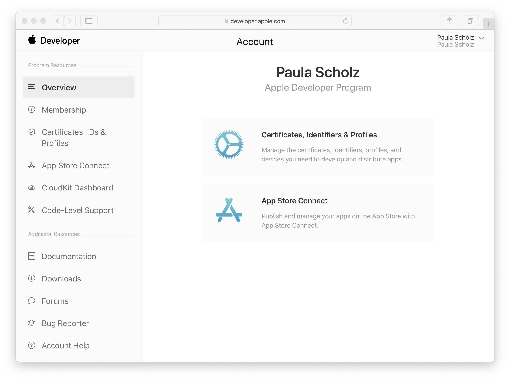
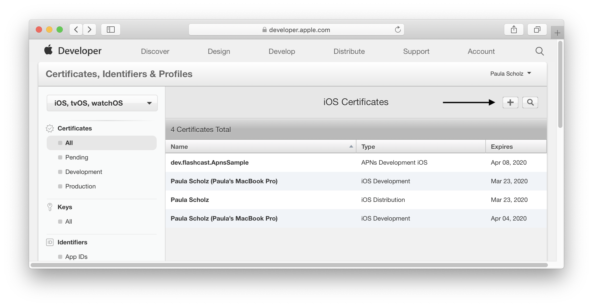

#  APNS Sample

This sample shows how to use the Apple Push Notification service **(APNs)** in your iOS 12 application. To receive notifications, the application must run on an actual iPhone device. You cannot receive notifications on the iOS Simulator.

While the prevelant language standard for iOS development at the time of writing *(April 2019)* is Swift, all code for this tutorial is written in Objective-C.  There are many excellent push notification articles on the web for [Swift](https://www.raywenderlich.com/8164-push-notifications-tutorial-getting-started "Push Notifications Tutorial: Getting Started"), but few comprehensive tutorials written for iOS 12 in Objective-C.

## Prerequisites

To send and receive push notifications for your iOS device, you must:

  * Configure your application and register it with the Apple Push Notification service (APNs).
  * Have an Apple Developer Program membership. To send push notifications from your server you need a push notification certificate for your Apple Developer ID, which requires program membership.
  * You need to have an iOS Developer Certificate in your Keychain Access store. The [signing workflow](https://help.apple.com/xcode/mac/current/#/dev60b6fbbc7 "iOS development signing workflow"), while complex, has been greatly simplified with the advent of Xcode 10. 
  * Have a server to send push notifications to your device. For this tutorial, we will use the free web-based [pushtry.com](http://pushtry.com "Pushtry notification testing server") server. This free site provides both iOS and Android push notification testing services.

## Configue your application

To register your application with the Apple Push Notification service, start Safari and go to the [Apple Developer Program site](https://developer.apple.com "Apple Developer Program website").  Sign in with your Apple Developer ID and then click **Account**. You will see a screen like this, hopefullty with your own name and not mine:



Click on the section that says *Certificates, Identifiers & Profiles*.  You will be taken to a screen that looks like this:


First, you must register an AppID for your push notifications client application.  In the left hand menu, press the choice that says **App IDs**.  You will be taken to a screen that looks like this:


Fill in the choice for your application name, and then select the **Explicit App ID** choice and fill in the choice using the convention of *domainSuffix.domainName.yourAppNamne*.  Then, in the **App Services** section below, make sure you select the choice that says **Push Notifications**. Scroll to the bottom of the page and press the **Continue** button.  Return to the main Apple Developer Program account page.

Next, to add a new certificate for Push Notification services, press the + button.  You will be taken to a screen that looks like this:


Press the choice that says *Apple Push Notification services SSL (Sandbox & Production*.  You may use this certificate for both scenarios.  Then, scroll to the bottom of the page and press the **Continue** button.

A binary SSL certificate will then be generated with the name of **AuthKey_XXXXXXXXXX.p8**, where the XXXXXXXXXX represents your key ID. You will be asked to download the certificate.  It can only be downloaded once, so make sure you keep it safe.

You will need this certificate to send push notifications from your server, but first it must be transformed from its binary form into a text form as a **.p12** file.  

```objc
#import <UIKit/UIKit.h>
#import <UserNotifications/UserNotifications.h>

@interface AppDelegate : UIResponder <UIApplicationDelegate, UNUserNotificationCenterDelegate>

@property (strong, nonatomic) UIWindow *window;

@property (strong, nonatomic) NSString *strDeviceToken;

@end
```
