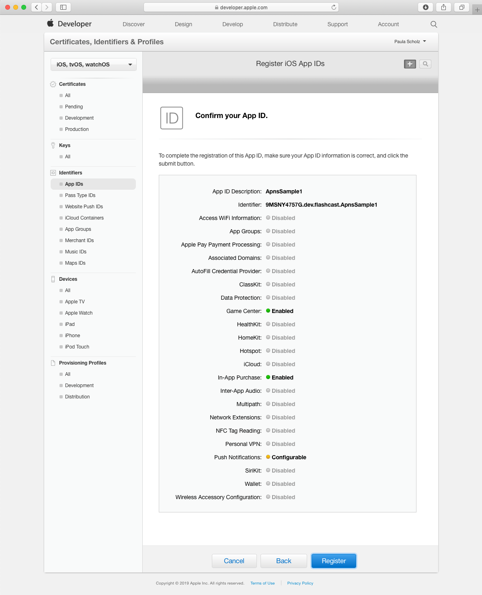
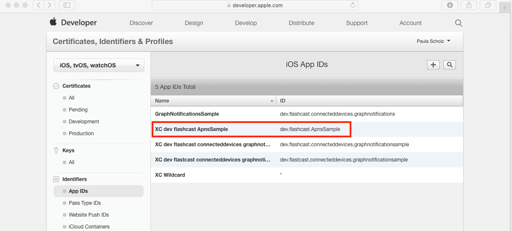

#  APNS Sample

This sample shows how to use the Apple Push Notification service **(APNs)** in your iOS 12 application. To receive notifications, the application must run on an actual iPhone device. You cannot receive notifications on the iOS Simulator.

While the prevelant language standard for iOS development at the time of writing *(April 2019)* is Swift, all code for this tutorial is written in Objective-C.  There are many excellent push notification articles on the web for [Swift](https://www.raywenderlich.com/8164-push-notifications-tutorial-getting-started "Push Notifications Tutorial: Getting Started"), but few comprehensive tutorials written for iOS 12 in Objective-C.

## Prerequistes

This tutorial assumes you have signed up for an Apple Developer account and have configured an **iOS Development Certificate** for your app.  You may refer to the Xcode [signing workflow](https://help.apple.com/xcode/mac/current/#/dev60b6fbbc7) for more information.

## Configue your application for Apple Push Notification

To send Push Notifications through the Apple Push Notification Service, you need an SSL certificate associated with an AppID provisioned for push notifications, and a provisioning profile for that AppID.

First, we'll create the SSL Certificate, for which we'll need a certificate signing request file.  This is easy to generate.

* Open the Keychain Access application on your Mac, from the Go menu in the Finder, or by searchinng for 'Keychain Access' with Spotlight.
* On the Keychain Access app menu, navigate to **Keychain Access -> Certificate Assistant -> Request a Certificate from a Certificate Authority, like this:


Input your email address and name, and select the **Request is: Saved to disk** radio button.  Click **Continue** to save the `.certSigningRequest` to your Mac.


You will need this certificate request later in the provisioning process.

To register your application with the Apple Push Notification service, start Safari and go to the [Apple Developer Program site](https://developer.apple.com "Apple Developer Program website").  Sign in with your Apple Developer ID and then click **Account**. You will see a screen like this, hopefullty with your own name and not mine:


Click on the section that says *Certificates, Identifiers & Profiles*.  You will be taken to a screen that looks like this:


Press the **App IDs** menu choice, and the list will change to **App IDs**.  Click the **+** button to add a new **AppID** like this:


You will be taken to a screen that looks like this:


Now, fill in the choice for your application name, and then select the **Explicit App ID** choice and fill in the choice using the convention of *domainSuffix.domainName.yourAppNamne*.  Then, in the **App Services** section below, make sure you select the choice that says **Push Notifications**. Scroll to the bottom of the page and press the **Continue** button.  You will see a screen that looks like this:



If everything looks fine, press the **Register** button to move to the next step.  You will be taken back to the list of **AppIDs**.  Click on the one you just created.



Your selection will expand to show you the details of that **AppID**.  Scroll to the bottom and press the **Edit** button.


You will see the **iOS App ID Settings** screen.  Scroll down to the Push Notifications section to create your **Apple Push notification service SSL Certificate**, using the `.certSigningRequest` we created in the very first step.  


Note that in this screenshot, we have already created our SSL certificate, but we will use the **Create an additional certificate** option to illustrate what to do.  Press the **Create Certificate** button.  You will see a page of instructions that looks like this:


We have already created our certificate request in the first step, so just press the **Continue** button.

Press the **Choose File...** button and upload the `.certSigningRequest` file we created in the very first step, then press the **Continue** button.  When the SSL certificate is ready, click **Download** to save it to your Mac, and click **Done** to close the certificate creation flow.


On the Mac, locate the downloaded SSL certificate and double-click it to install it into your keychain.

Now, open **Keychain Access**.  Under **My Certificates**, locate the certificate you just added. It should be called *Apple Development IOS Push Service: your.bundle.id*.

Right-click on the certificate, select **Export Apple Developmennt IOS Push Services: your.bundle.id** and save it as a .p12 file.  Don't enter a password.


Your app is now enabled to use the Push Notification development certificate.  When you are ready to release, you'll need to repeat this for the Push Notification production environment by clicking **Create Certificate** under the **Production SSL Certificate** section instead of the **Development SSL Certificate.**

You will need this **.p12** certificate to send notifications with your server.  Later in this tutorial, we will use the **pushtry.com** test server to send **Apple Push Notifications** to the app.

## Provisioning Profile

To test your app under development, you need a **Provisioning Profile** for development to authorize test devices to run an app that is not yet published on the **Apple App Store**.

Navigate to the [Apple Developer Member](https://developer.apple.com/account) site and sign in.  Naviate to **Certificates, Identifiers and Profiles**.  In the drop down menu, choose **iOS, tvOS, watchOS** and at the bottom of the left-hand side menu, you will see **Provisioning Profiles** Click **Development** and you will see a screen that looks like this:


Note that in this screenshot, we have already created our provisioning profile, but we will create another to illustrate the procedure.  Click the **+** button at the top-right to create a new profile.  You will see a screen that looks like this:


Select the **iOS App Development** choice and press the **Continue** button.  Then, select an AppID in the drop-down menu and press **Continue** again.


Select the certificates to include in the provisioning profile.  To use this profile to install an app, the **iOS Development Certificate** the app was signed with must be included.  If you can't remember which one you used, just select them all, and press **Continue**.

Select the test devices you wish to include in this **Provisioning Profile**. To install an app signed with this profile on a device, the device must be included.  Select your devices and press **Continue**.


Give your **Provisioning Profile** a name and press **Continue**.  Your profile will be generated and you can download it to your Mac.  


Press the **Done** button. To install the newly-generated **Provisioning Profile**, simply double-click it.

## The Code

Objective-C code needed to implement the Apple Push Notification Service in an iPhone application is straightforward.  All the action takes place in the application's **AppDelegate**.  First, we need to modify `AppDelegate.h` to include User Notifications, like this:

```objc
#import <UIKit/UIKit.h>
#import <UserNotifications/UserNotifications.h>

@interface AppDelegate : UIResponder <UIApplicationDelegate, UNUserNotificationCenterDelegate>

@property (strong, nonatomic) UIWindow *window;

@property (strong, nonatomic) NSString *strDeviceToken;

@end
```
We need to import the UserNotfications framework:

`import <UserNotifications/UserNotifications.h>`

Next, add the UNUsderNotificationCneterDelegate to our interface:

`@interface AppDelegate : UIResponder <UIApplicationDelegate, UNUserNotificationCenterDelegate>`

Then, we add a property to store the Device Token.  The Device Token represents the APNs "address" of the test device, and is echoed to the debug console when we run our test app.

`@property (strong, nonatomic) NSString *strDeviceToken;`

Next, we need to implement User Notifications in the `AppDelegate.m` implementation file.  The first step is to register for Push Notifications, inside `didFinishLaunchingWithOptions`.  This must take place on the application's main thread.  We use `dispatch_async` like this:

```objc
- (BOOL)application:(UIApplication *)application didFinishLaunchingWithOptions:(NSDictionary *)launchOptions {
    
    NSLog(@"inside didFinishLaunchingWithOptions");

    // execute on main thread only
    dispatch_async(dispatch_get_main_queue(), ^{
        [self registerForRemoteNotifications];
    });
    
    return YES;
}
```

Let's look at the `registerForRemoteNotification` method:

```objc
// this must be called from the main thread
- (void)registerForRemoteNotifications {
    
    NSLog(@"inside registerForRemoteNotifications");
    
    // UserNotifications are available in iOS 10 and above
    if(@available(iOS 10,*)){
        UNUserNotificationCenter *center = [UNUserNotificationCenter currentNotificationCenter];
        center.delegate = self;
        [center requestAuthorizationWithOptions:(UNAuthorizationOptionSound | UNAuthorizationOptionAlert | UNAuthorizationOptionBadge) completionHandler:^(BOOL granted, NSError * _Nullable error){
            if(!error){
                NSLog(@"registerd for remote notifications");
                
                // execute on main thread only
                dispatch_async(dispatch_get_main_queue(), ^{
                    [[UIApplication sharedApplication] registerForRemoteNotifications];
                });
                
            }
            else
            {
                
                NSLog(@"error in notification registration : %@", [error localizedDescription]);            }
        }];
    }
}
```

First, we use the `@available(iOS 10,*)` macro to ensure we're on ***iOS 10*** or above.  We make a local copy of the `UNUserNotificationCenter` and use it to call `requestAuthorizationWithOptions`, which include Sound, Alerts, and Badge annotations.  In the Completion Handler for this call, on the main thread, we call `UIApplication` method `registerForRemoteNotifications`.

If we successfully registered for User Notifications, the `didRegisterForRemoteNotificationsWithDeviceToken` method will be called by the framework with our Device Token, like this:

```objc
// If we did successfully register for device notifications, get our device token and put it on the debug console
- (void)application:(UIApplication *)application didRegisterForRemoteNotificationsWithDeviceToken:(NSData *)deviceToken{
    
    NSString *strDevicetoken = [[NSString alloc]initWithFormat:@"%@",[[[deviceToken description] stringByTrimmingCharactersInSet:[NSCharacterSet characterSetWithCharactersInString:@"<>"]] stringByReplacingOccurrencesOfString:@" " withString:@""]];
    
    NSLog(@"Device Token = %@",strDevicetoken);
    
    self.strDeviceToken = strDevicetoken;
}
```

The Device Token will be reported on the Debug Console.  Copy and save this Device Token somewhere, because you will need it when you test notifications with the `pushtry.com` test server.  The Device Token will look something like this:

`d208701ca0a75a079ce53982d686388cb0ac14bb55d6ad87331d9f1af9114ae2`

**This Device Token may change from build to build as you add features.  It is important that you check this value each time you build for testing and if the Device Token changes, use the new token for subsequent notifications.**  

If you are not receiving notifications on your test device, check this value to ensure you are using the correct one for the build on your device.

There are two delegate methods that must be implemented to receive notifications, one called when your app is in the foreground and the other when your app is off-screen or not active.  These are:

```objc
//Called when a notification is delivered to a foreground app.
-(void)userNotificationCenter:(UNUserNotificationCenter *)center willPresentNotification:(UNNotification *)notification withCompletionHandler:(void (^)(UNNotificationPresentationOptions options))completionHandler{
    
    completionHandler(UNAuthorizationOptionSound | UNAuthorizationOptionAlert | UNAuthorizationOptionBadge);
    
    [self handleRemoteNotification:[UIApplication sharedApplication] userInfo:notification.request.content.userInfo];
}

// if the user presses on the notification while the app is in background, launch the content in the passed URL in Safari
- (void)userNotificationCenter:(UNUserNotificationCenter *)center
didReceiveNotificationResponse:(UNNotificationResponse *)response
         withCompletionHandler:(void(^)(void))completionHandler {
    
    // The method will be called on the delegate when the user responded to the notification by opening the application,
    // dismissing the notification or choosing a UNNotificationAction.
    // The delegate must be set before the application returns from applicationDidFinishLaunching:.
    
    NSLog(@"User Info : %@",response.notification.request.content.userInfo);
    
    [self handleRemoteNotification:[UIApplication sharedApplication] userInfo:response.notification.request.content.userInfo];
}
```

Note that both methods call the same handler to process the notification.  In each case, the handler will search the `NSDictionary` object for the `linkURL` key to process the passed URL value and then launch Safari with the URL for display in the browser.

```objc
// Process the remote notification contents, grab the sent URL, and launch Safari with that URL
-(void) handleRemoteNotification:(UIApplication *) application userInfo:(NSDictionary *) remoteNotif {
    
    NSLog(@"handleRemoteNotification Dictionary: %@", remoteNotif);
    
    // get the dictionary of values from the notification
    NSDictionary* aps = [remoteNotif valueForKey:@"aps"];
    
    // get the linkURL string from the aps Dictionary
    NSString* linkURL = [[NSString alloc] initWithString:[aps valueForKey:@"linkURL"]];
    
    NSLog(@"linkURL: %@", linkURL);
    
    // if we got a linkURL element in the JSON, launch Safari with the URL
    if(linkURL){
        
        // convert the string to an actual URL
        NSURL* url =[NSURL URLWithString:[linkURL stringByAddingPercentEncodingWithAllowedCharacters:[NSCharacterSet URLQueryAllowedCharacterSet]]];
        
        // launch Safari with the URL
        [[UIApplication sharedApplication] openURL:url options:@{} completionHandler:nil];
    }
}
```

While there is a legacy iOS API for binary notifications, in this demo we are using the new notification scheme, which uses JSON.  The JSON we send in the notification looks like this:

```json
{"aps":{"alert":"Press to go to SharePoint","badge":1,"sound":"default", "linkURL":"https://microsoft.sharepoint.com/teams/WinDevEngagements"}}
```

In a JSON viewer, this looks like this:


APNS has published a [guide](https://developer.apple.com/library/archive/documentation/NetworkingInternet/Conceptual/RemoteNotificationsPG/CreatingtheNotificationPayload.html#//apple_ref/doc/uid/TP40008194-CH10-SW1) to their JSON formats, with lots of other useful information on the push service on custom actions that are beyond the scope of this tutorial.

## Testing Push Notifications

To test APNS notifications, we use a free web-based service at [pushtry.com](https://www.pushtry.com), which provides push testing services for iOS and Android.


Notice that we have entered our Device Token and JSON, and have clicked the **Browse** button to upload our **.p12** certificate to the server.  You will need to do this each time to send a notification.  Make sure you have the **JSON&** radio button selected.  If you send **JSON** as text, the notification will not work.

Press the **Send** button to send the notification.  If all goes well, you will receive the APNS notification on your device.  **Note that this procedure will not work on the iOS Simulator, you MUST use a device.**

The app itself is simply a blank page.  If it is in the foreground, the app will launch the Safari browser and navigate to the **linkURL**.  If the app is in the background or not started, you must tap the notification, either before it disappears or inside the Apple Notification Center.  The app will launch and then launch Safari with the **linkURL**.

To get to the Apple Notification Center, simply swipe from the top of the iPhone page and it will appear in the foreground.  Once activated, the notification will be removed from the Apple Notification Center UI.

## Troubleshooting

If you do not receive a notification, or Safari does not launch, check the following:

* Ensure the Device Token you are sending from **pushtry.com** matches the Device Token in the build on the device.
* Ensure you have selected the JSON radio button before sending a notification with JSON from **pushtry.com**.
* Make sure you have uploaded your certificate.
* If Safari does not launch, don't be discouraged. Perhaps the iPhone did not register your tap on the notification, which happens sometimes. If it did not, the notification should be in the Apple Notification Center and you can try again.  
* Notifications are not 100% guaranteed. They do not always work.

The **pushtry.com** server has a short timeout.  If you get an ASP.Net error when you press the **Send** button, simply close the browser tab, launch **pushtry.com** in a new tab, and try again.

## Conclusion

Push notification services are a complex topic, with many ways to go astray.  Don't be discouraged if your notifications don't go through the first time, and sometimes they just don't work at all.

Good luck, and happy notifying!!!

Paula Scholz
April 2019, Bellevue, WA  USA


